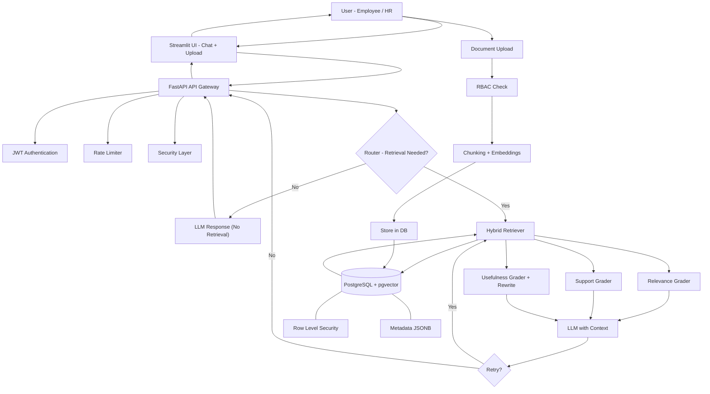

# PolicyIQ - Intelligent Organizational Policy Assistant

**A production-grade AI-powered chatbot for HR policies, leave policies, and organizational documents.**

Built with LangGraph, Self-RAG, PostgreSQL + pgvector, and enterprise-grade security features. Designed to demonstrate senior-level AI engineering skills.


---

## ✨ Key Features

- **Advanced Self-RAG System**
  - Intelligent routing: Decides whether document retrieval is needed
  - Relevance grading of retrieved chunks
  - Support grading (Fully Supported / Partially Supported / Not Supported)
  - Automatic retry logic with max_retries to eliminate hallucinations
  - Usefulness scoring + query rewriting for better performance

- **Enterprise Security & Access Control**
  - Manual JWT authentication with access + refresh token rotation
  - Role-Based Access Control (RBAC) — Only HR users can upload documents
  - Row-Level Security (RLS) in PostgreSQL for department-based document isolation
  - Hierarchical rate limiting based on user designation (Executive → Intern)
  - Prompt injection detection + PII redaction + input sanitization

- **Organizational RAG Capabilities**
  - Global document access across all threads
  - Secure department-scoped visibility
  - Hybrid retrieval (dense vector + BM25 + FlashRank reranker)
  - Support for PDFs and research papers with rich metadata

- **Observability & Evaluation**
  - Full integration with LangSmith for tracing
  - RAGAS framework for systematic evaluation of retrieval and generation quality

---

## 🛠️ Tech Stack

- **Backend**: FastAPI + LangGraph + LangChain
- **Vector Database**: PostgreSQL + pgvector
- **Frontend**: Streamlit
- **Authentication**: Custom JWT (manual implementation)
- **Security**: RBAC + RLS + Rate Limiting + Sanitization
- **Evaluation**: RAGAS
- **Containerization**: Docker + docker-compose

---

## 📁 Project Structure

```bash
src/
├── api/                    # FastAPI routes, middleware, rate limiting
├── auth/                   # JWT utilities, OAuth2, dependencies
├── backend/                # LangGraph graph, Self-RAG nodes, tools, rag_tool
├── database/               # SQLAlchemy models, Alembic migrations, RLS policies
├── security/               # Prompt injection guard, PII redaction, sanitization
├── config.py               # Centralized configuration
├── main.py                 # Streamlit frontend
└── requirements.txt
```

---

## 🧠 System Architecture



## High-Level System Workflow

Here's how **PolicyIQ** works end-to-end:

### 1. User Interaction
Users (Employees or HR personnel) interact with the application through the **Streamlit UI**.  
They can ask questions naturally or upload policy/HR documents (upload functionality is visible and accessible **only to HR users**).

### 2. Request Processing & Security Layers
Every incoming request passes through the **FastAPI API Gateway**, where multiple security layers are applied sequentially:
- **JWT Authentication**: Validates user identity using access and refresh tokens.
- **RBAC (Role-Based Access Control)**: Ensures only users with the `HR` role can upload documents.
- **Hierarchical Rate Limiter**: Applies different request limits based on user designation/role (Executive → Manager → Employee → Intern).
- **Security Layer**: Performs prompt injection detection, PII redaction, and input sanitization.

### 3. Intelligent Routing (Self-RAG Core)
After passing security checks, the request enters the **LangGraph Agent**:

- **Router Node**: Determines whether document retrieval is required for the query.
  - If **no retrieval needed** → The LLM generates a direct response.
  - If **retrieval needed** → The query proceeds to the RAG pipeline.

### 4. Retrieval & Self-Reflection Loop
When retrieval is required:
- **Hybrid Retriever** fetches relevant chunks from **PostgreSQL + pgvector** using a combination of dense embeddings, BM25, and FlashRank reranking.
- **Row Level Security (RLS)** automatically filters documents so users only see content they are authorized to access (global or department-specific).
- **Self-RAG Graders** evaluate the quality of retrieval and generation:
  - **Relevance Grader**: Checks if the retrieved documents are relevant to the query.
  - **Support Grader**: Classifies the generated answer as **Fully Supported**, **Partially Supported**, or **Not Supported** by the context.
  - **Usefulness Grader**: Scores answer quality and suggests an improved query if needed.

- If the answer is **Partially Supported** or **Not Supported**, the system automatically **loops back** (retry) to regenerate a better, fully grounded response.
- A configurable `max_retries` limit prevents infinite looping.

### 5. Response Delivery
The final grounded response, complete with citations from source documents, is returned through the API to the Streamlit UI.  
All interactions are traced in **LangSmith** for observability and debugging.

### 6. Document Ingestion Flow (HR Only)
- When an HR user uploads a document:
  - RBAC verifies permission.
  - The document is chunked and embedded.
  - Rich metadata (`department`, `visibility`, `uploaded_by`, etc.) is attached using the `cmetadata` JSONB field.
  - Chunks are stored in PostgreSQL with **Row Level Security** policies enforced.

---

### Key Design Principles

- **Defense-in-Depth Security**: Protection is applied at the API, agent, and database levels.
- **Hallucination Reduction**: Self-RAG with support grading and retry logic ensures responses are grounded in actual documents.
- **Organizational Compliance**: Global documents with fine-grained department isolation via RLS.
- **Production Readiness**: Modular architecture, clean separation of concerns, and Docker support.

This architecture makes PolicyIQ not just an intelligent chatbot, but a **secure, reliable, and enterprise-ready** solution for organizational policy management.

## 🚀 Key Technical Highlights

- Implemented Self-RAG with multiple grader nodes and conditional edges in LangGraph  
- Used `cmetadata` JSONB field + PostgreSQL RLS for secure, scalable document filtering  
- Built a clean modular monolith architecture  
- Hierarchical rate limiting based on user designation/role  
- Full grounding of responses with mandatory citations  
- Production-ready Docker setup with multi-stage builds  

---

## ⚙️ Local Setup

### 1. Clone the repository
```bash
git clone <your-repo-url>
cd multipurposechatbot
```

### 2. Environment Setup
```bash
# Copy the example environment file
cp .env.example .env
```

Edit `.env` and add your keys:
- OPENAI_API_KEY  
- SECRET_KEY (generate using `openssl rand -hex 32`)  
- LANGCHAIN_API_KEY (optional but recommended)  
- Database credentials  

---

### 3. Run with Docker Compose (Recommended)
```bash
docker-compose up --build
```

---

### 4. Access the application

- **Streamlit UI**: http://localhost:8501  
- **FastAPI Docs**: http://localhost:8000/docs  

---

## 🔑 Environment Variables

See `.env.example` for all required and optional variables.

Key variables include:

- OPENAI_API_KEY  
- SECRET_KEY  
- POSTGRES_CONNECTION  
- REDIS_URL  
- LANGCHAIN_API_KEY  

---

## 🔮 Future Enhancements

- CI/CD pipeline with GitHub Actions  
- Cloud deployment (Render / Railway)  
- Admin dashboard for document management  
- User feedback collection and fine-tuning loop  
- Multi-modal document support  